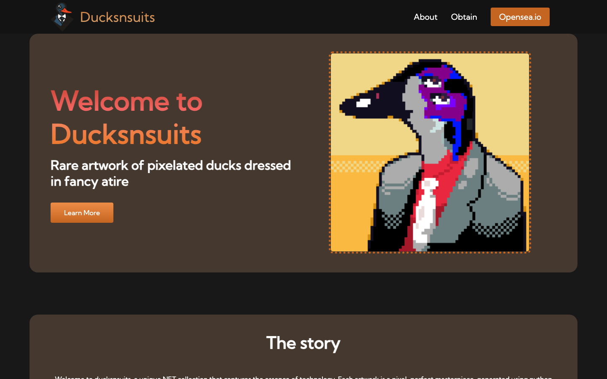

# Ducksnsuits

Landing site for **Ducksnsuits**, a 100-piece pixel-art NFT collection of ducks in suits. It was a personal project started in 2021. The pitch was that 20% of each sale would be donated to a portfolio of clean-energy and carbon-removal companies.



## What's here

A hand-built static website with no framework and no build step:

| File | Purpose |
|---|---|
| `index.html` | Home page: hero, the story, and calls to action linking to the OpenSea collection |
| `About.html` | Backstory, the donation model, and the clean-energy portfolio (Tokamak Energy, First Light Fusion, Climeworks and others) |
| `app.css` / `appabout.css` | Hand-written responsive styles: flexbox layout, a mobile hamburger menu, hover states |
| `Aesthetic.js` | Mobile menu toggle and fade-in-on-scroll effects |
| `Pictures/` | Collection artwork and imagery |
| `CNAME` | Custom domain config for GitHub Pages |

## Running it

There's nothing to install. Open `index.html` in a browser, or serve the folder:

```bash
python3 -m http.server 8000
# then visit http://localhost:8000
```

## What I learned

- Building a responsive layout from scratch with CSS flexbox and media queries, with no framework
- A mobile navigation pattern in plain JavaScript
- Deploying a static site to a custom domain with GitHub Pages
- The other side of launching a product: positioning, storytelling, and pointing people to an external marketplace (OpenSea)

## Status

Archived. This was one of my first web projects (2021–2023). I keep it here to show where I started.
